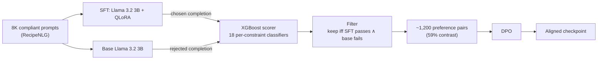

I'm a strong "devil's advocate." In every group project or exam, I'm the one poking at the assumption everyone else accepted and moved past. That instinct has only sharpened as I've started my career in AI, ML, and software engineering, and most recently while sitting with the idea of recursive self-improvement.

My interest was piqued after reading [Anthropic's piece on AI accelerating its own development](https://www.anthropic.com/institute/recursive-self-improvement). The loop it describes is as follows: a less capable model helps train a more capable one, and so on. The obvious objection that any skeptic (like myself) would reach for is that this effectively parallels trying to master research-grade mathematics by studying under a third-grade teacher.

The resolution to this query came from [OpenAI's paper on weak-to-strong generalization](https://openai.com/index/weak-to-strong-generalization/). Effectively, **the weak teacher doesn't transfer its ceiling, but rather its target**, enabling the stronger learner to generalize beyond its noise (so long as this noise is scattered, as opposed to systematic bias learnable by the student). This is exactly what I sought out to test.

Naturally, the fault-finder in me was not only interested in the idea of **RLAIF** (Reinforcement Learning from AI Feedback) for this reason, but also for its capability to scale over RLHF. I was then led to the following research question:

> "For tasks with a verifiable correctness signal, can a cheap, domain-specific classifier replace human raters entirely?"

To test, I chose the domain of dietary constraint satisfaction, as compliance to a given constraint (nut-free, vegan, etc) is binary, automatically verifiable, yet often failed by smaller base-models. Compliance to this domain serves as a broader signal for cheap-training onto specific verticals that are similarly easily verified.

## The pipeline

The setup is a standard preference-optimization stack with the human swapped out for a classifier. I began by training 18 binary XGBoost constraint classifiers (one per dietary constraint) on 10,000 seed-labeled RecipeNLG recipes using TF-IDF features. Labels were bootstrapped with regex pattern matching, a simple form of programmatic labeling in the spirit of weak supervision ([Ratner et al. 2016](https://arxiv.org/abs/1605.07723)). Applying XGBoost atop these programmatic labels serves two purposes: it generalizes beyond the regex's exact coverage by learning ingredient co-occurrence distributions in TF-IDF space, smoothing out labeling noise; and it produces a cheap, consistent compliance signal capable of steering a much larger model, consistent with OpenAI's weak-to-strong generalization findings (Burns et al., 2023). This approach does still carry limitations, which are discussed later.

I proceeded to fine-tuned Llama 3.2 3B on 8,000 constraint-compliant examples via QLoRA SFT, generated preference pairs by pitting the SFT model's completions against the untuned base model's and letting an XGBoost compliance scorer decide which pairs to keep, running DPO on the survivors. The classifiers act as a cheap, automatic stand-in for human annotators, replacing the "H" in RLHF with a reward signal that is consistent, scalable, and free. The full implementation can be found [here](https://github.com/joeyb007/pantry-pal).

The two models generate independently: the SFT model produces the candidate "chosen," the untuned base produces the candidate "rejected." The XGBoost scorer acts as a filter. A pair only survives if the SFT completion passes every constraint and the base completion fails at least one. This meant a lot of the base pairs didn't qualify, as ~8000 prompts collapsed to only 1200 usable pairs.

*shoutout to Claude for generating this awesome flowchart*

## The contrast rate problem

The first thing that inevitably broke was the source of the rejected completions. The filter only keeps a pair when the chosen completion passes and the rejected one fails, so you need genuine disagreement between the two to get any surviving pairs at all. When I drew both completions from the SFT model, only **0.86%** of pairs cleared the filter (making me waste an entire day of GPU compute). The model was already too good; both completions were almost always compliant, so they landed on the same side of the scorer and got discarded together. Switching the rejected completion to come from the untuned base model pushed the survival rate to **59%**. The lesson generalizes well beyond this project:

> The reference model you sample rejections from is extremely important - a strong model will inevitably hand you completions on the same side of its decision boundary very frequently.

## Results

| Model | Compliance | Training cost |
| --- | --- | --- |
| base Llama 3.2 3B | 54.92% | — |
| GPT-4o | 56.79% | — |
| DPO (classifier preferences) | 72.02% | ~$8 + DPO |
| SFT (Llama 3.2 3B) | 99.69% | ~$8 |

**SFT alone hits 99.69% compliance**, a different tier entirely from base Llama (54.92%), GPT-4o (56.79%), and even DPO (72.02%), with a total training cost of under $8 on a cloud rented 4090. There are two surprising results here: **the frontier model barely beats the untuned base model on this eval**, and **DPO landed below SFT** despite being the step that was supposed to improve it. The next two sections explain exactly why.

## DPO made it worse

Something I really didn't expect was that **DPO degraded compliance by 27.67pp** relative to the SFT checkpoint it started from. My first hypothesis is **PEFT adapter stacking**: DPO was training a second LoRA adapter on top of the SFT adapter, and the composition of the two didn't behave like clean continued optimization of a single set of weights. In future settings, I would merge the SFT adapter into the base weights before DPO so the reference model is a clean, frozen copy and DPO trains a single fresh adapter against it, rather than stacking. There is also an alternative hypothesis which is worth acknowledging: the SFT model may have **overfit**, leading it to learn an overly conservative strategy: avoiding forbidden words entirely. DPO might have nudged the model toward more natural language, like writing "use gluten-free flour" instead of just never mentioning gluten. A bag-of-words classifier can't tell the difference. It sees the word, flags a violation, even though the recipe is actually compliant. Under this hypothesis, the model would have gotten better, while the metric got worse. Running DPO again with adapter stacking fixed would reveal which is true.

## The bias-variance tradeoff

As mentioned in the intro, weak-to-strong generalization works when the teacher's errors are scattered noise the student can average out, and fails when those errors are a systematic bias the student can lock onto. **Bias-variance is the precise name for that distinction.** Human labelers are **high variance, low bias**: they disagree with each other and with themselves, but in aggregate they're aimed at the right target, which is exactly the scattered noise weak-to-strong tolerates. The XGBoost ensemble is the opposite: **low variance, high bias**: perfectly consistent, and consistently wrong in the same specific ways. This is the exact bias weak-to-strong fails under.

The first instinct that my intrinsic critic jumped to was that the high-bias option was worse. In fact, it almost led me to scrap this investigation entirely. In reflection, the nuance I recognized was that a high-bias weak supervisor is not universally bad. Rather, it depends on whether its failure modes align with your objective. A keyword classifier trained on TF-IDF features is a strong proxy for constraint satisfaction as defined by keyword presence, but a poor proxy for semantic compliance as a human would judge it. If your goal is the former, the bias is a feature. If your goal is the latter, it propagates directly into your strong model's blind spots.

> Key takeaway: when training weak-to-strong, you inherit both the weak model's signal and bias. Choose a weak supervisor whose failure modes you're willing to live with.

## Honest evaluation

This is exactly why the headline numbers need an asterisk. My XGBoost classifier doesn't handle negation well, so some of its consistency is consistency in being wrong, and any policy trained against it inherits that exact blindspot. And GPT-4o's 56.79% almost certainly understates its true capability. So, what do the numbers actually tell you? A tiny model trained on classifier-verified data can match or beat a frontier model on this eval, but the bias comes bundled in.

## Conclusion

Does removing the H from RLHF work? **For SFT with classifier-verified data, yes, clearly, and at trivial cost.** For DPO with classifier-generated preferences, the classifier's systematic errors propagate into the learned policy in ways human raters' scattered noise wouldn't. That's the whole answer to the question I opened with: **a weak teacher can lift a stronger student, but only when its mistakes are inconsistent noise rather than systematic bias.** The third-grade teacher works right up until the moment they're confidently, consistently wrong about the same thing. A narrow classifier is exactly that kind of teacher. So the question to ask before trusting one isn't its accuracy, but rather whether you're willing to live with its same failure modes.
